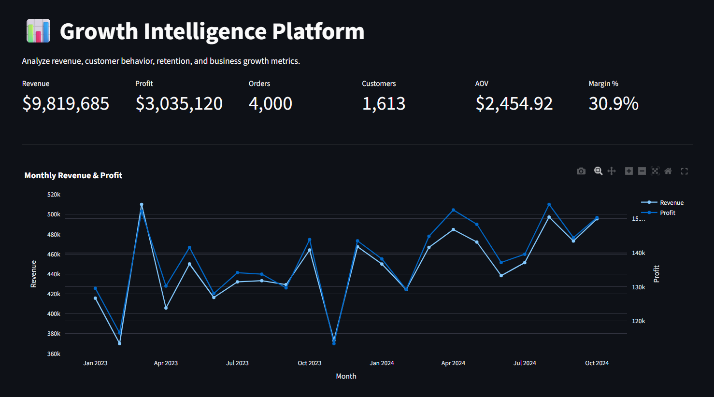
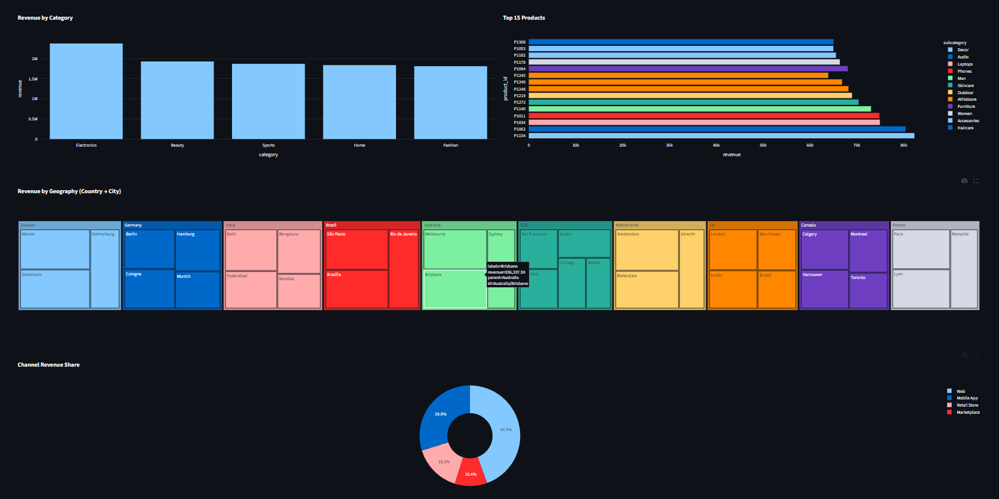
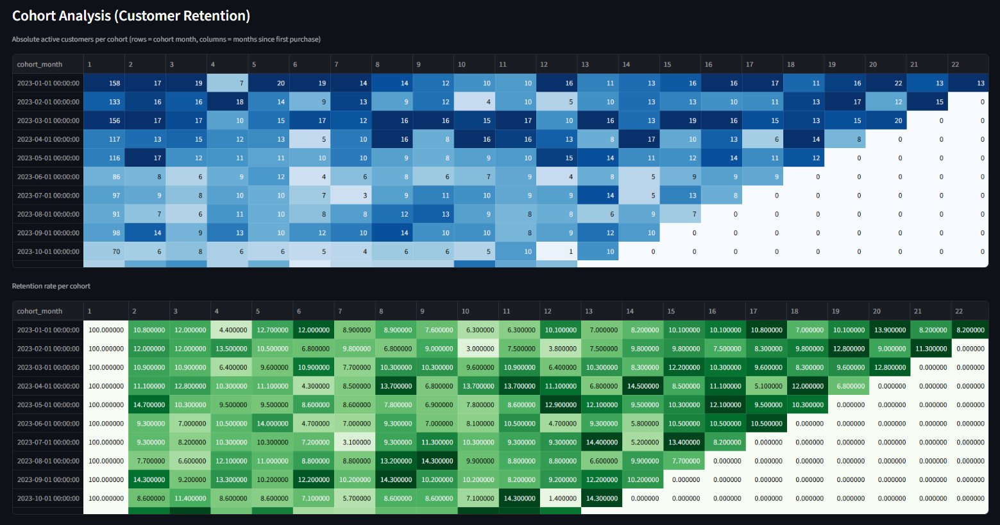
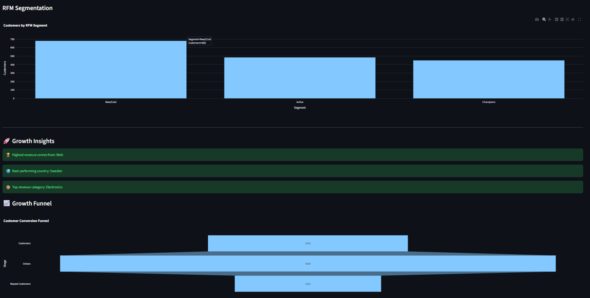
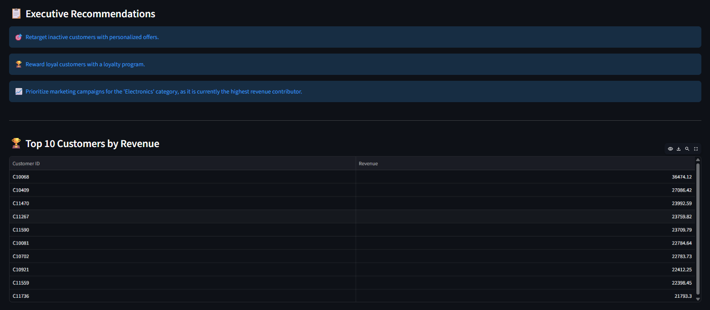

# 🚀 Growth Intelligence Platform

An interactive Product Analytics and Business Intelligence platform built with **Python**, **Streamlit**, and **Plotly**. The application helps analyze customer behavior, revenue trends, product performance, and business KPIs through interactive dashboards and data visualizations.

---

## 📖 Overview

Growth Intelligence Platform is designed to transform raw transactional data into actionable business insights. It provides visual dashboards for monitoring revenue, customer segmentation, retention trends, and product performance, enabling data-driven decision-making.

---
## 🌐 Live Demo

**Streamlit App:** https://patipranavi-growth-intelligence-platform-appapp-a2g1jj.streamlit.app/

---
## 📸 Dashboard Preview

### Main Dashboard



---
### 📈 Revenue Analytics



---
### 📊 Cohort Analysis (Customer Retention)



---
### 👥 Customer Analytics



---
### 📋 Executive Recommendations



---

## ✨ Features

- 📊 Interactive Business Dashboard
- 💰 Revenue Analysis
- 👥 Customer Segmentation (RFM Analysis)
- 📈 Cohort Retention Analysis
- 🌍 Geographic Sales Analysis
- 📦 Product Performance Dashboard
- 📋 Business KPI Monitoring
- 📉 Executive-Level Business Insights
- 🎛️ Interactive Filters and Visualizations
- ☁️ Live Cloud Deployment using Streamlit Community Cloud

---

## 🛠️ Tech Stack

| Category | Technologies |
|----------|--------------|
| Language | Python |
| Dashboard | Streamlit |
| Data Processing | Pandas, NumPy |
| Visualization | Plotly, Matplotlib |
| Machine Learning | Scikit-learn |
| Database | SQL (Extendable) |
| Version Control | Git, GitHub |
| Deployment | Streamlit Community Cloud |

---

## 📂 Project Structure

```text
Growth-Intelligence-Platform
│
├── app/
│   ├── app.py
│   └── utils/
│       └── data_utils.py
│
├── data/
│   └── orders.csv
│
├── images/
│   ├── dashboard.png
│   ├── revenue-analytics.png
│   ├── cohort-analysis.png
│   ├── customer-analytics.png
│   └── executive-dashboard.png
│
├── requirements.txt
├── .gitignore
└── README.md
```

---
## 📊 Dashboard Modules

### 📌 Business Overview
- Total Revenue
- Total Orders
- Total Customers
- Average Order Value

---

### 📌 Revenue Analytics
- Revenue Trends
- Monthly Sales
- Category-wise Revenue
- Product Performance

---

### 📌 Customer Analytics
- Customer Segmentation (RFM)
- Customer Distribution
- Geographic Analysis
- Repeat Customer Analysis

---

### 📌 Retention Analytics
- Cohort Retention Matrix
- Customer Retention Rate
- Customer Activity Analysis

---

## 🚀 Getting Started

### Clone the Repository

```bash
git clone https://github.com/PatiPranavi/Growth-Intelligence-Platform.git
```

### Navigate to the Project

```bash
cd Growth-Intelligence-Platform
```

### Install Dependencies

```bash
pip install -r requirements.txt
```

### Run the Application

```bash
streamlit run app/app.py
```

The dashboard will be available at:

```
http://localhost:8501
```

---


## 📈 Key Analytics

- Revenue Trend Analysis
- Customer Segmentation
- Cohort Analysis
- Geographic Insights
- Product Performance
- KPI Monitoring

---

## 🎯 Future Enhancements

- 🤖 AI-generated Business Insights
- 📈 Customer Churn Prediction
- 📢 User Acquisition Dashboard
- 💹 Marketing Campaign Analytics
- 💰 Customer Lifetime Value Prediction
- 📊 A/B Testing Dashboard
- 🔮 Revenue Forecasting
- 🧠 LLM-powered Decision Assistant

---

## 📚 Skills Demonstrated

- Data Cleaning
- Exploratory Data Analysis (EDA)
- Business Analytics
- Customer Analytics
- Data Visualization
- Dashboard Development
- Business Intelligence
- Product Analytics

---

## 🤝 Contributing

Contributions, suggestions, and feature improvements are welcome.

1. Fork the repository
2. Create a feature branch
3. Commit your changes
4. Open a Pull Request
