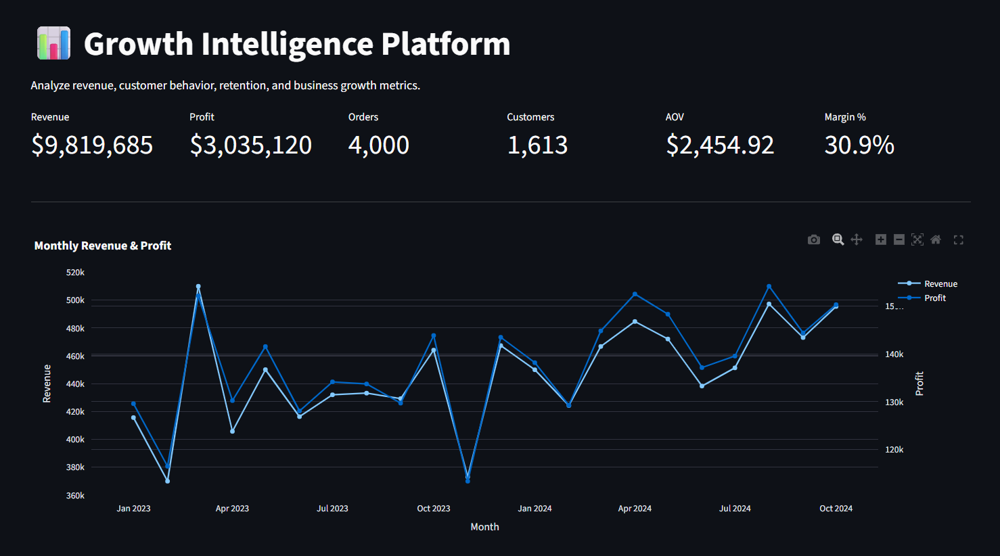
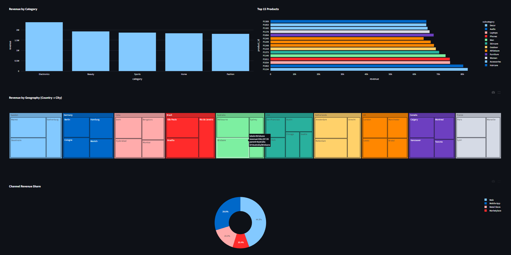
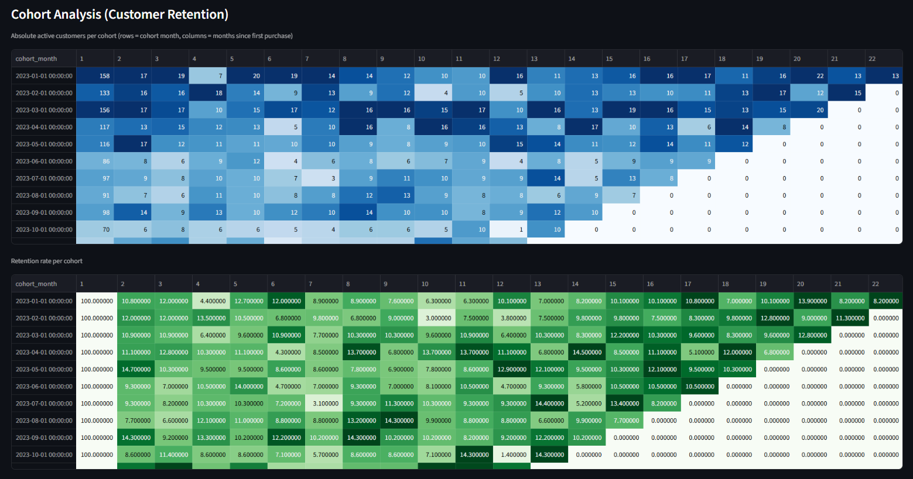
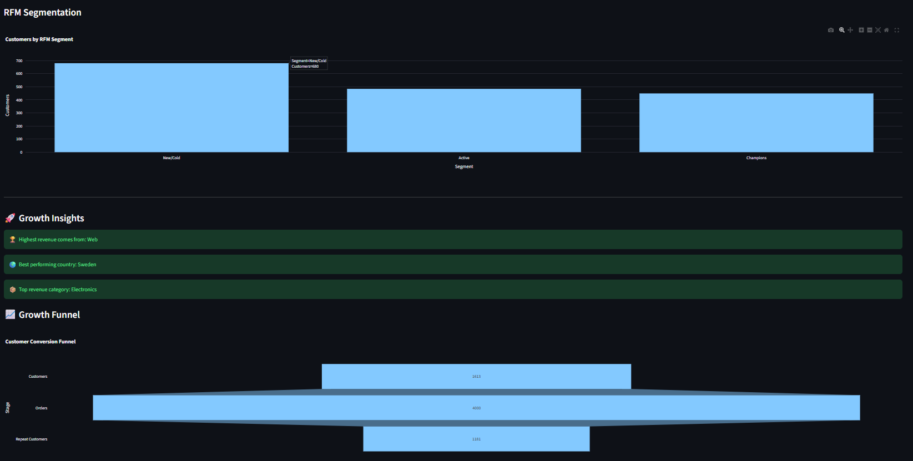
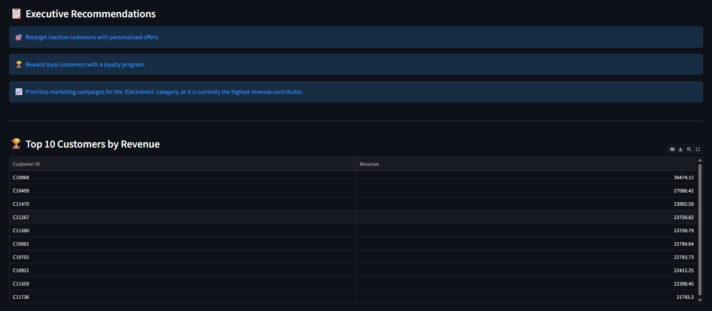

# 🚀 Growth Intelligence Platform

An end-to-end **Data Analytics, Business Intelligence, and AI-powered analytics platform** that transforms raw transactional data into actionable business insights using **SQL, Python, Power BI, DAX, Streamlit, RAG, and Google Gemini**.

The project analyzes revenue performance, customer behavior, product performance, retention, profitability, and business growth through analytical queries, exploratory data analysis, interactive dashboards, executive-level recommendations, and a **RAG-powered Analytics Intelligence Assistant**.

---

## 📖 Overview

The **Growth Intelligence Platform** follows an end-to-end analytics and AI workflow:

**Raw Business Data → SQL Analysis → Python EDA → Power BI Dashboard → Streamlit Application → RAG Analytics Assistant → Business Insights**

The platform is designed to answer practical business questions such as:

- How is revenue and profit changing over time?
- Which categories and channels generate the most revenue?
- Which customers contribute the most value?
- How well are customers being retained?
- Which products and locations perform best?
- Which customer segments require attention?
- Where can the business improve profitability and growth?
- What insights can be retrieved from the project's analytical knowledge?

---

## 🌐 Live Demo

**Streamlit Application:**  

https://patipranavi-growth-intelligence-platform-appapp-a2g1jj.streamlit.app/

---

## 📸 Dashboard Preview

### Main Dashboard



---

### 📈 Revenue Analytics



---

### 📊 Cohort Analysis



---

### 👥 Customer Analytics



---

### 📋 Executive Recommendations



---

## ✨ Key Features

### 📊 Business Intelligence

- Interactive Business Intelligence Dashboard
- Revenue and Profitability Analysis
- Monthly Revenue & Profit Trend Analysis
- Customer Analytics and RFM Segmentation
- Cohort Retention Analysis
- Product and Category Performance Analysis
- Geographic Revenue and Profit Analysis
- Channel Performance Analysis
- Business KPI Monitoring
- Year-over-Year Revenue Growth Analysis
- Interactive Power BI Slicers and Filters
- Drill-down and Cross-filtering
- Executive-Level Business Insights and Recommendations
- Live Streamlit Cloud Deployment

### 🤖 RAG-Powered Analytics Intelligence Assistant

The platform includes an AI assistant that allows users to ask natural-language questions about the project's analytical knowledge.

The assistant uses **Retrieval-Augmented Generation (RAG)** to retrieve relevant project information before generating an answer with a Large Language Model.

#### RAG Architecture

```text
User Question
      ↓
Sentence Transformer Embedding
      ↓
FAISS Vector Search
      ↓
Relevant Project Knowledge
      ↓
Context Construction
      ↓
Google Gemini LLM
      ↓
Grounded Business Answer
```

#### RAG Components

- **Knowledge Base** — Curated project-specific analytical knowledge
- **Embeddings** — Sentence Transformers (`all-MiniLM-L6-v2`)
- **Vector Search** — FAISS
- **Retriever** — Semantic similarity-based retrieval
- **LLM** — Google Gemini
- **Grounding** — Retrieved project knowledge is provided as context to the LLM
- **Hallucination Control** — The assistant does not invent information that is unavailable in the project knowledge
- **Error Handling** — Graceful handling of unavailable LLM services

#### Example Questions

- Which category performs best?
- Which channel performs best?
- What are the key business insights?
- Which city generates the highest profit?

The assistant can also recognize when information is outside the available project knowledge and respond accordingly rather than fabricating an answer.

---

## 🛠️ Tech Stack

| Category | Technologies |
|----------|--------------|
| Programming | Python |
| Data Analysis | Pandas, NumPy |
| Visualization | Plotly, Matplotlib |
| Database / Analytics | SQL |
| Business Intelligence | Power BI |
| Calculations | DAX |
| Dashboard Application | Streamlit |
| RAG | Retrieval-Augmented Generation |
| Embeddings | Sentence Transformers |
| Vector Search | FAISS |
| Large Language Model | Google Gemini |
| Version Control | Git, GitHub |
| Deployment | Streamlit Community Cloud |

---

## 📂 Project Structure

```text
Growth-Intelligence-Platform

│
├── app/
│   ├── app.py
│   └── utils/
│       └── data_utils.py
│
├── data/
│   └── orders.csv
│
├── sql/
│   ├── 01_data_validation.sql
│   ├── 02_business_kpis.sql
│   ├── 03_customer_analytics.sql
│   ├── 04_cohort_retention.sql
│   ├── 05_product_analysis.sql
│   └── 06_advanced_business_analysis.sql
│
├── python/
│   └── 01_eda.py
│
├── rag/
│   ├── __init__.py
│   ├── embeddings.py
│   ├── retriever.py
│   ├── assistant.py
│   └── knowledge_base/
│       ├── analytics_knowledge.json
│       └── embeddings.npy
│
├── images/
│   ├── dashboard.png
│   ├── revenue-analytics.png
│   ├── cohort-analysis.png
│   ├── customer-analytics.png
│   └── executive-dashboard.png
│
├── powerBI.pbix
├── requirements.txt
├── .gitignore
└── README.md
```

---

## 🔄 End-to-End Workflow

### 1. Raw Data

Transactional order data is used as the foundation for the analysis.

### 2. SQL Analysis

SQL is used for:

- Data validation
- Business KPI analysis
- Customer analytics
- Cohort retention analysis
- Product analysis
- Advanced business analysis

### 3. Python EDA

Python is used for:

- Data exploration
- Statistical analysis
- Profitability analysis
- Distribution analysis
- Correlation analysis
- Discount analysis
- Trend analysis
- Validation of analytical results

### 4. Power BI

Power BI and DAX are used to create:

- KPI cards
- Revenue and profit trends
- Category analysis
- Channel analysis
- Geographic analysis
- Profit margin analysis
- YoY growth analysis
- Interactive slicers
- Drill-down analysis
- Cross-filtering
- Tooltips

### 5. Streamlit

The Streamlit application brings the analytics together into an interactive business intelligence platform.

It provides:

- Interactive filters
- KPI monitoring
- Revenue and profit analysis
- Customer analytics
- Cohort analysis
- RFM segmentation
- Growth insights
- Executive recommendations
- Top customer analysis
- Filtered data download

### 6. RAG Analytics Assistant

The RAG layer provides a natural-language interface over the project's analytical knowledge.

The assistant converts the user's question into an embedding, retrieves the most relevant project knowledge using FAISS, and provides the retrieved context to Gemini to generate a grounded response.

---

## 📊 Business Insights

The analysis identified several important business insights:

- **Electronics** is the strongest-performing category across revenue, profit, and profit margin.
- **Web** is the highest-revenue channel.
- **Malmö** is the highest-profit city.
- **March** is the highest-revenue month.

These insights are incorporated into the project's analytics knowledge base for retrieval by the AI assistant.

---

## 💡 Business Recommendations

Based on the analysis, the platform provides recommendations such as:

- Improve profitability by monitoring discount levels.
- Increase Average Order Value through product bundles and upselling.
- Retarget inactive customers with personalized offers.
- Reward loyal customers through loyalty programs.
- Prioritize high-performing product categories.
- Focus marketing efforts on strong-performing channels.
- Use customer and product analytics to identify growth opportunities.

---

## 🔐 API Key Security

The Gemini API key is **not stored in the source code or GitHub repository**.

For local development, the API key can be provided through an environment variable or Streamlit secrets.

For deployment, the API key should be configured using **Streamlit Cloud Secrets**.

**Never commit API keys or `secrets.toml` files to the repository.**

---

## 🚀 Getting Started

### Clone the Repository

```bash
git clone https://github.com/PatiPranavi/Growth-Intelligence-Platform.git
cd Growth-Intelligence-Platform
```

### Create a Virtual Environment

```bash
python -m venv venv
```

### Activate the Environment

Windows:

```bash
venv\Scripts\activate
```

### Install Dependencies

```bash
pip install -r requirements.txt
```

### Run the Streamlit Application

```bash
streamlit run app/app.py
```

---

## 🤖 RAG Assistant Setup

Configure the Gemini API key using an environment variable or Streamlit secrets.

Generate the knowledge embeddings using:

```bash
python rag/embeddings.py
```

The generated embeddings are stored in:

```text
rag/knowledge_base/embeddings.npy
```

Then run the Streamlit application:

```bash
streamlit run app/app.py
```

The **Analytics Intelligence Assistant** will be available inside the dashboard.

---

## 🔮 Future Enhancements

- Natural-language SQL generation
- Automated dashboard insight generation
- Conversational data analysis
- Advanced business-question answering
- Query-to-visualization generation
- Automated anomaly detection
- Forecasting and predictive analytics
- Integration with additional LLM-powered analytics workflows

---

## 🎯 Skills Demonstrated

- SQL
- Advanced SQL Analytics
- Python
- Pandas
- NumPy
- Exploratory Data Analysis
- Statistical Analysis
- Power BI
- DAX
- Data Visualization
- Business Intelligence
- Customer Analytics
- RFM Segmentation
- Cohort Analysis
- Product Analytics
- Revenue Analytics
- Business Insight Generation
- Streamlit
- Retrieval-Augmented Generation
- Embeddings
- Vector Search
- FAISS
- Sentence Transformers
- LLM Integration
- Prompt Engineering
- API Integration
- Git & GitHub
- Cloud Deployment

---

## 👩‍💻 Author

**Pranavi Pati**

Data Analytics | Business Intelligence | AI & Machine Learning